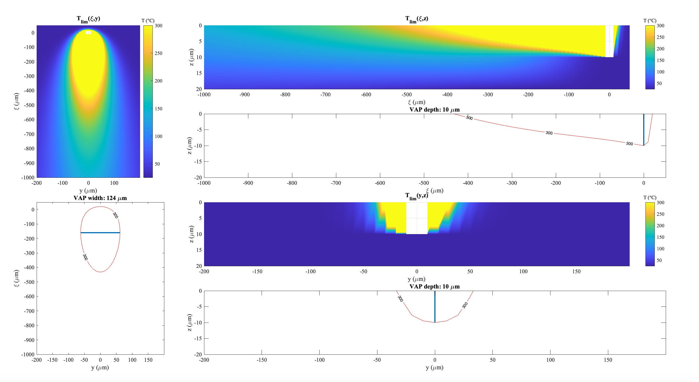
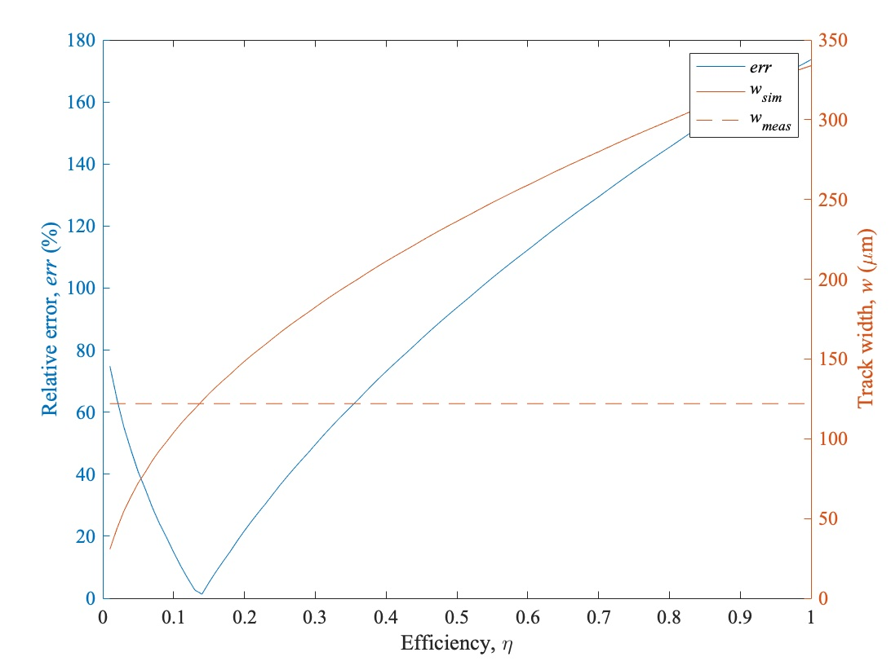
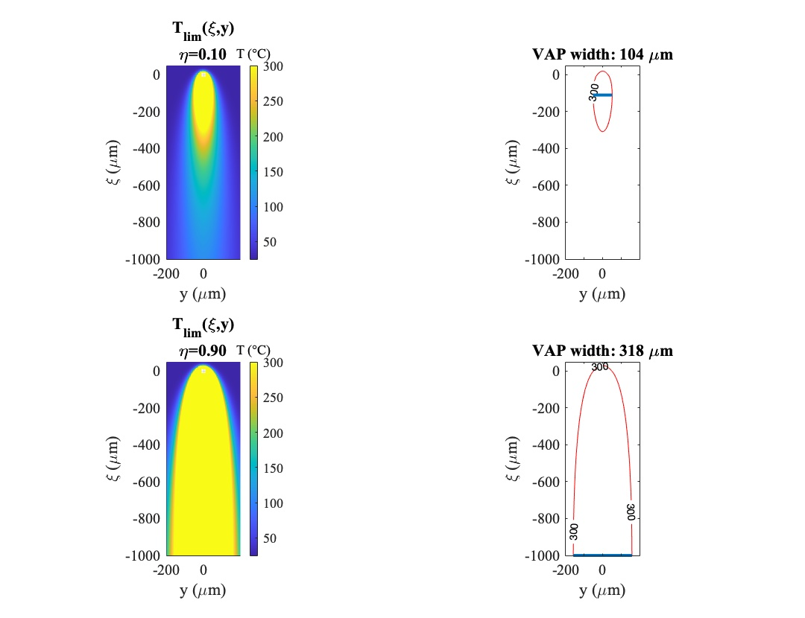
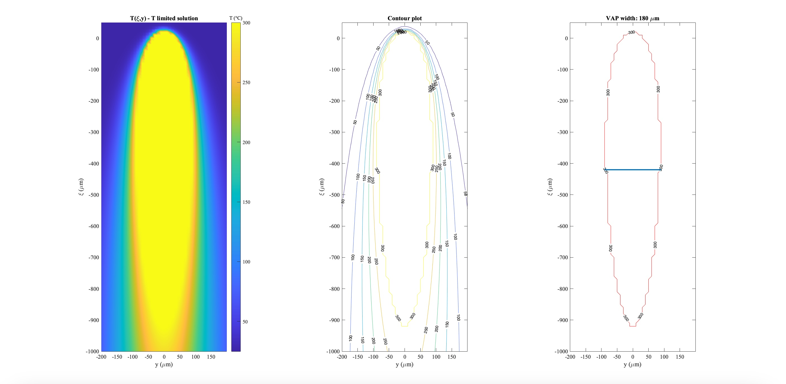
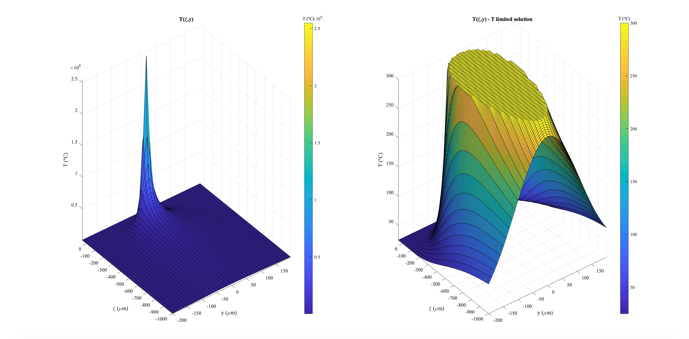

# Thermal Field Simulation for Vaporization Analysis

This project simulates the temperature field generated by a power source over a surface, particularly focusing on vaporization dynamics. The MATLAB code models the temperature distribution over a 3D domain and applies a temperature limit to identify vaporization zones, where the temperature reaches or exceeds a threshold (the vaporization temperature, `Tvap`). This simulation is essential for understanding heat diffusion and efficiency in applications like laser-based materials processing.

## Project Overview

1. **Thermal Field Calculation**: 
   The code computes the temperature field `T(x, y, z)` generated by a heat source moving across the surface. The model considers parameters like thermal conductivity, density, specific heat, power, and speed. The vaporization temperature (`Tvap`) is set as the maximum threshold, beyond which the temperature in the simulation is capped.

2. **Vaporization Area and Track Width**:
   The code calculates the Vaporization Affected Zone (VAP) width at specific efficiency levels (`η`) by examining the area where the temperature exceeds `Tvap`. It also compares simulated track width with experimentally measured values to adjust efficiency for a closer match.

3. **Efficiency Calibration**:
   The efficiency coefficient is calibrated by comparing the simulated track width with a known measurement. The optimal efficiency minimizes the relative error in track width, which is iteratively calculated over a range of efficiency values.

4. **Penetration Depth Calculation**:
   For deeper insight, the code evaluates penetration depth into the material, visualized in various cross-sections.

## Results Visualization

### Figure 1: Temperature Field Cross-sections
Illustrates the calculated temperature fields in cross-sectional views across different axes. Colors indicate temperature gradients, with higher temperatures represented by yellow and lower by blue.

### Figure 2: Relative Error and Track Width vs. Efficiency
Shows the relationship between efficiency and track width, as well as the relative error between simulated and measured values. The optimal efficiency minimizes this error.

### Figure 3: Temperature Field at Different Efficiencies
Temperature field comparison at low (`η = 0.1`) and high (`η = 0.9`) efficiencies, highlighting the effect of efficiency on the vaporization area.

### Figure 4: VAP Zone Analysis
The vaporization zone contour and width for a calibrated efficiency, showcasing the final track width achieved with optimal efficiency.

### Figure 5: 3D Temperature Profile
3D visualization of the temperature profile across the surface, with a comparison between the initial solution and the limited temperature solution.

## Code Highlights

The code follows these key steps:

1. **Initialization of Parameters**: 
   Defines thermal and process parameters, as well as spatial domain setup for accurate resolution in the simulation.

2. **Temperature Field Calculation**:
   Uses nested loops to compute temperature at each point `(x, y, z)` in the 3D grid, with temperature limited to `Tvap`.

3. **Track Width and Efficiency Calibration**:
   Iteratively adjusts efficiency to minimize error between simulated and measured track widths.

4. **Depth and Width of Vaporization Area**:
   Uses contour plotting to visualize the extent of the vaporization area and calculate its width and depth.

Feel free to adjust the parameters as needed for different materials or power levels.
